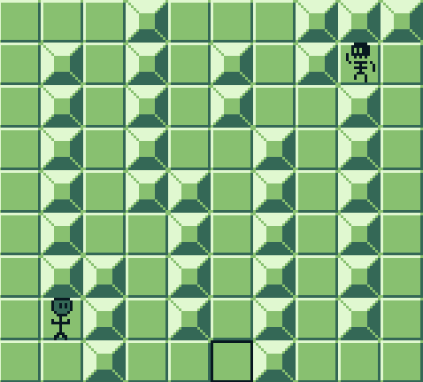
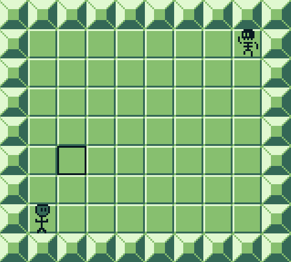
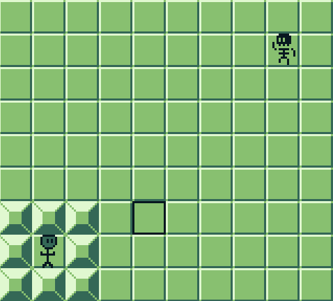
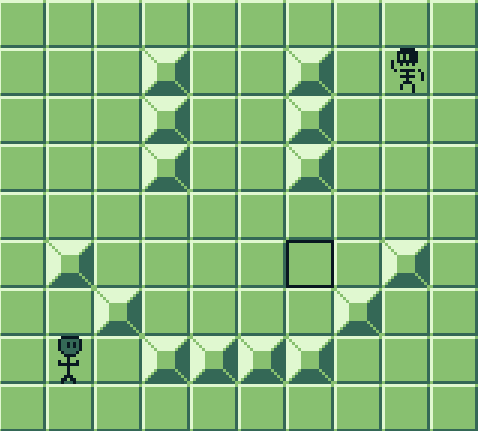

# A* Star pathfinding demonstration in Gameboy development
Made for a final project in CS370 at NJIT.

## Demos








## Building
Requires [gbdk-2020](https://github.com/gbdk-2020/gbdk-2020).
```bash
git clone https://github.com/hahdookin/GB_AStar.git
cd GB_AStar
make
```
Note: You may have to update the path to your compiler in `Makefile`.

Run `bin/main.gb` with the Gameboy emulator of your choice.
